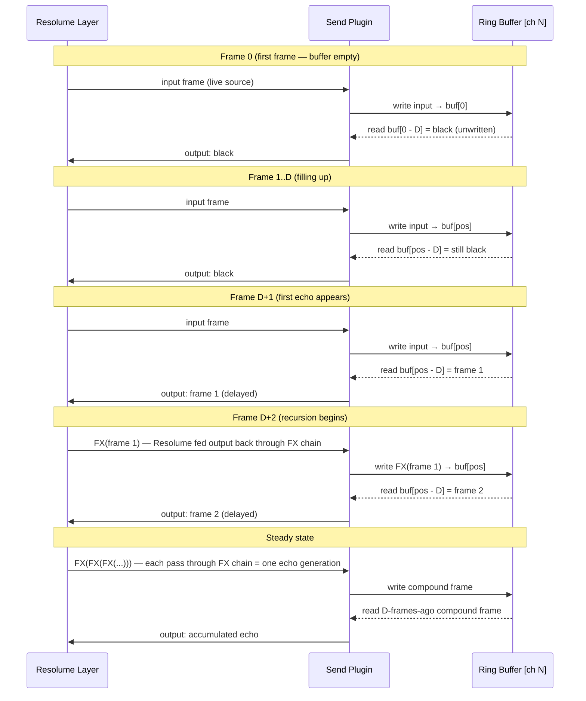
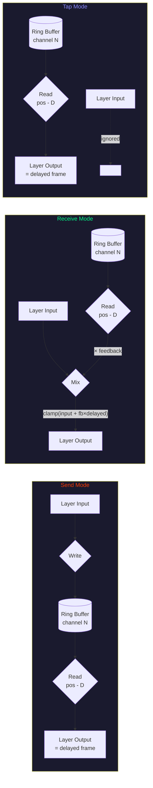
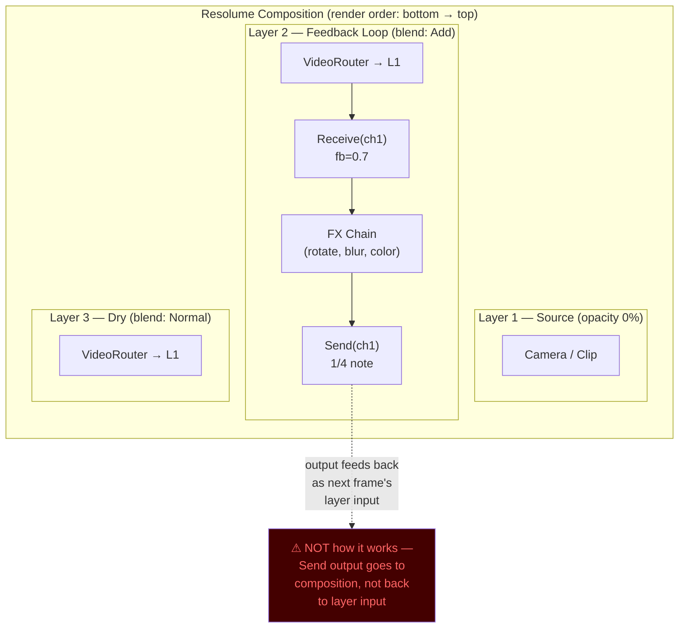
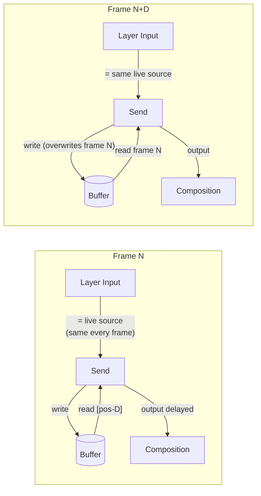
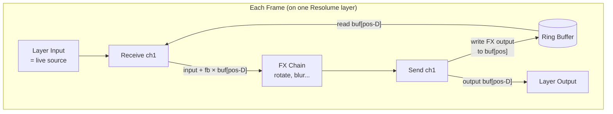

# Delay Line Module — Signal Flow

## Send: Self-Contained Recursive Overdub

This is the core feedback loop. A single Send instance on one Resolume layer
creates a wet-only echo that compounds through the FX chain every loop iteration.



**Key insight**: The FX chain on the Resolume layer (rotate, scale, color, blur, etc.)
IS the feedback function. Every trip through the loop applies it once more. Decay comes
from layer opacity or color effects — the plugin itself has no feedback gain control in
Send mode.

## All Three Modes — Data Flow



## Parameter Relevance by Mode

```
             Send    Receive    Tap
            ------  ---------  -----
Channel       ✓        ✓        ✓     which buffer to use
Sync Mode     ✓        ✓        ✓     how delay time is calculated
Subdivision   ✓        ✓        ✓     delay time (if sync=subdivision)
Delay Ms      ✓        ✓        ✓     delay time (if sync=ms)
Delay Frames  ✓        ✓        ✓     delay time (if sync=frames)
Feedback      -        ✓        -     mix amplitude of delayed signal
```

Time params are meaningful in ALL modes — they control the read position.
Send uses them because it outputs the delayed frame, not the input.

## Resolume Composition: Recursive Overdub



**Wait — where does the recursion actually happen?**

In the current code, Send writes its input and outputs the delayed frame.
But Resolume doesn't feed a layer's output back to its own input — layers
are one-pass top-to-bottom. The recursion happens purely through the **buffer**:



**With Send alone, there's no recursion** — each frame writes the same live source.
The buffer just holds D copies of the input. Output is always a D-frame-old copy of
the same source. No compound echoes.

**For actual recursive overdub, you need Receive → FX → Send on the same channel:**



This is the magic: **Receive mixes live + delayed, FX transforms it, Send writes
the compound result back.** Each generation accumulates another pass of the FX chain.
The buffer contents evolve over time — they're not just copies of the source.
