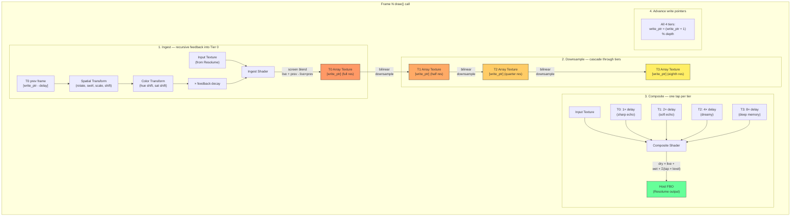

# Dream Looper — Architecture & Data Flow

## Overview

All-GPU temporal pyramid with musically-timed echo taps. Zero CPU pixel work.
Each tier trades spatial resolution for temporal depth — distant echoes are
naturally blurrier, which IS the aesthetic.

## Per-Frame Pipeline



## Pyramid Memory Layout

```
Tier 0 — Full resolution, 288 frames (~4.8s at 60fps)
┌──────┬──────┬──────┬──────┬─── ─── ───┬──────┐
│  f0  │  f1  │  f2  │  f3  │    ...    │ f287 │  GL_TEXTURE_2D_ARRAY
└──────┴──────┴──────┴──────┴─── ─── ───┴──────┘
   ▲ write_ptr            ◄── 1× delay ──► tap 1 samples here

Tier 1 — Half resolution, 576 frames (~9.6s)
┌──────┬──────┬──────┬──────┬─── ─── ───┬──────┐
│  f0  │  f1  │  f2  │  f3  │    ...    │ f575 │  each frame = bilinear(T0)
└──────┴──────┴──────┴──────┴─── ─── ───┴──────┘
   ▲ write_ptr       ◄───── 2× delay ─────► tap 2 samples here

Tier 2 — Quarter resolution, 1152 frames (~19.2s)
┌──────┬──────┬──────┬──────┬─── ─── ───┬──────┐
│  f0  │  f1  │  f2  │  f3  │    ...    │f1151 │  each frame = bilinear(T1)
└──────┴──────┴──────┴──────┴─── ─── ───┴──────┘
   ▲ write_ptr  ◄──────── 4× delay ────────► tap 3 samples here

Tier 3 — Eighth resolution, 2304 frames (~38.4s)
┌──────┬──────┬──────┬──────┬─── ─── ───┬──────┐
│  f0  │  f1  │  f2  │  f3  │    ...    │f2303 │  each frame = bilinear(T2)
└──────┴──────┴──────┴──────┴─── ─── ───┴──────┘
   ▲ write_ptr ◄────────── 8× delay ──────────► tap 4 samples here
```

## Musical Tap Timing

```
Example: 120 BPM, 1/4 note subdivision = 30 frames (0.5s)

                    ◄─── 1 beat ───►
Tap 1 (T0):         ╠═══════════════╣ 30 frames back   — sharp echo
Tap 2 (T1):         ╠═══════════════╬═══════════════╣ 60 frames — soft
Tap 3 (T2):         ╠═══════════════╬═══════════════╬═══════════╬═══════════╣ 120 frames — dreamy
Tap 4 (T3):         ╠═══╬═══╬═══╬═══╬═══╬═══╬═══╬═══╣ 240 frames — deep memory

Resolution:         [████ full ████] [██ half ██] [█ qtr █] [⅛]
                     ◄── crisp ──►                ◄── dreamy ──►
```

## Ingest: Recursive Feedback Detail

The ingest shader is where echoes are born. Each stored frame is:

```
stored = screen(live, transform(prev[delay]) × feedback)
```

The transform chain (applied to prev frame's UVs):
```
1. center:    uv = uv - 0.5
2. scale:     uv *= scale_factor
3. swirl:     rotate by (swirl × distance_from_center)
4. rotate:    apply 2D rotation matrix
5. uncenter:  uv = uv + 0.5 + shift
6. bounds:    mirror (kaleidoscope) or soft-clip (smoothstep fade)
```

Because feedback is recursive, the Nth echo has N× the rotation, N× the swirl,
etc. This creates the spiral/kaleidoscope buildup naturally.

## Composite: Output Mixing

```
trail = tap1_level × T0[1 × delay]
      + tap2_level × T1[2 × delay]
      + tap3_level × T2[4 × delay]
      + tap4_level × T3[8 × delay]

output = dry × live + wet × trail
```

- Tap levels are independent and overdrivable (0-2 range)
- Default decay: 1.0, 0.7, 0.4, 0.2
- dry and wet are independent (not linked), both 0-2 range

## GL Resources

| Resource | Type | Count | Purpose |
|----------|------|-------|---------|
| Tier array textures | GL_TEXTURE_2D_ARRAY | 4 | Frame storage (ring buffers) |
| Tier FBOs | GL_FRAMEBUFFER | 4 | Render target per tier |
| Ingest shader | GL program | 1 | Live + feedback → T0 |
| Downsample shader | GL program | 1 | Tier N-1 → Tier N |
| Composite shader | GL program | 1 | All tiers → output |
| Fullscreen quad | VAO + VBO | 1 | Shared geometry |

## Source Files

| File | Lines | Purpose |
|------|-------|---------|
| dream.rs | ~250 | Plugin struct, draw loop, FFGL interface |
| shader.rs | ~550 | GLSL sources, shader compilation, uniform caching |
| pyramid.rs | ~210 | Texture array allocation, FBO management, write pointers |
| params.rs | ~200 | 18 FFGL parameters, value mapping |
| midi.rs | ~100 | MIDI CC output for subdivision/feedback sync |
| lib.rs | ~10 | Entry point |

## Parameters

| # | Name | Range | Default | Maps to |
|---|------|-------|---------|---------|
| 0 | Dry | 0-2 | 1.0 | Live signal level |
| 1 | Wet | 0-2 | 0.5 | Echo mix level |
| 2 | Tap 1 | 0-2 | 1.0 | T0 echo (1× delay, sharp) |
| 3 | Tap 2 | 0-2 | 0.7 | T1 echo (2× delay, soft) |
| 4 | Tap 3 | 0-2 | 0.4 | T2 echo (4× delay, dreamy) |
| 5 | Tap 4 | 0-2 | 0.2 | T3 echo (8× delay, deep) |
| 6 | Feedback | 0-1 | 0.85 | Decay per recursive echo |
| 7-8 | Shift X/Y | ±0.5 UV | 0 | Translation per echo |
| 9 | Rotation | ±180° | 0 | Z rotation per echo |
| 10 | Scale | 0.5×-2.0× | 1.0× | Zoom per echo |
| 11 | Swirl | ±2.0 rad | 0 | Spiral twist per echo |
| 12 | Hue Shift | ±180° | 0 | Color rotation per echo |
| 13 | Sat Shift | ±0.5 | 0 | Saturation per echo |
| 14 | Mirror | off/on | off | Kaleidoscope edge reflection |
| 15 | Fold | 0.1-1.0 | 1.0 (off) | Luminance fold threshold |
| 16 | BPM | 50-200 | 120 | Tempo reference |
| 17 | Subdivision | discrete | 1/4 | 1/16, 1/8, 1/4, 1/2, 1 bar |
