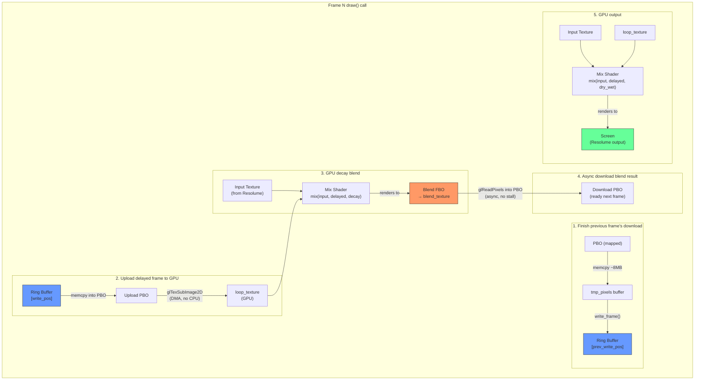

# Video Looper — Architecture & Data Flow

## Per-Frame Pipeline

The plugin runs as a Resolume effect. Each frame, Resolume calls `draw()` with
the input texture (whatever is upstream in the effect chain). The plugin acts as
a video delay line with feedback.



## Memory Layout

```
Ring Buffer (system RAM)
┌────────┬────────┬────────┬────────┬─── ─── ───┬────────┐
│frame 0 │frame 1 │frame 2 │  ...   │           │frame N │  N = 30fps × 30sec = 900
└────────┴────────┴────────┴────────┴─── ─── ───┴────────┘
    ▲
    │ write_pos wraps here
    │ (loop_len frames, set by BPM × loopBeats)
    │
    ├─── write_pos advances by 1 each frame
    │    loop_len might be 60 frames (4 beats @ 120 BPM)
    │    so only frames 0..59 are "active"
    │    frames 60..899 sit unused until loopBeats changes
```

## PBO Double-Buffering

```
Frame N:   begin_download → PBO[0]     (GPU starts async DMA)
Frame N+1: begin_download → PBO[1]     (GPU starts async DMA)
           finish_download ← PBO[0]    (map + memcpy, DMA already done)
Frame N+2: begin_download → PBO[0]     (reuse, orphan old data)
           finish_download ← PBO[1]    (map + memcpy)
```

The key insight: we always read from the PBO we filled **two frames ago**,
giving the GPU time to complete the async transfer. Same pattern for uploads.

## GL Resources (created once per resolution)

| Resource        | Type       | Purpose                                      |
|-----------------|------------|----------------------------------------------|
| `loop_texture`  | GL texture | Holds the delayed frame uploaded from buffer  |
| `blend_texture` | GL texture | Render target for GPU decay blend             |
| `blend_fbo`     | GL FBO     | Framebuffer attached to blend_texture         |
| `read_fbo`      | GL FBO     | Used by PBO download (glReadPixels source)    |
| `download_pbos` | GL PBO ×2  | Double-buffered GPU→RAM transfer              |
| `upload_pbos`   | GL PBO ×2  | Double-buffered RAM→GPU transfer              |

## Parameter Effect on Data Flow

| Param      | Where it acts                     | What it does                        |
|------------|-----------------------------------|-------------------------------------|
| loopBeats  | write_pos wrap point              | Sets active region of ring buffer   |
| decay      | GPU blend shader (step 3)         | 0=fresh input, 1=keep old frame     |
| quality    | CPU blur on wrap (once per cycle) | Tape wear: blur all active frames   |
| dry/wet    | GPU output shader (step 5)        | 0=live input, 1=loop only           |

## Source File Map

| File             | Responsibility                              | Lines |
|------------------|---------------------------------------------|-------|
| `lib.rs`         | Entry point, wires plugin to ffgl-core      | ~10   |
| `looper.rs`      | Main struct, draw loop, GL resource mgmt    | ~200  |
| `ring_buffer.rs` | RAM frame storage, degradation blur         | ~100  |
| `pbo.rs`         | PBO lifecycle, async GPU↔RAM transfers      | ~170  |
| `params.rs`      | FFGL parameter definitions and mapping      | ~85   |
| `shader.rs`      | Vertex/fragment shader, quad rendering      | ~200  |
